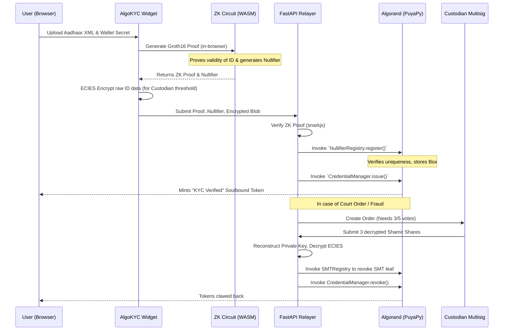

# AlgoKYC: Privacy-Preserving Zero-Knowledge Identity for Algorand

AlgoKYC is a comprehensive Zero-Knowledge KYC infrastructure built natively for the Algorand blockchain. It enables users to prove they hold a valid government-issued ID (like Indian Aadhaar) and meet specific criteria (e.g., over 18 years old, citizen of India) **without ever revealing their personal identity, address, or biometrics to the dApp or on-chain.**

It solves the fundamental Web3 dilemma: How do protocols prevent Sybil attacks and comply with regulations while maintaining the absolute privacy and anonymity of their users?

---

## 🛑 The Problem

Modern Web3 protocols (DeFi, RWAs, DAOs) face a regulatory trilemma:
1. **Compliance vs. Privacy:** Selling real-world assets or launching regulated tokens requires KYC. But forcing users to upload their passports to a smart contract or a centralized third-party risks massive data breaches, doxxing, and censorship.
2. **Sybil Attacks vs. Anonymity:** Airdrops, quadratic voting, and grant distribution are constantly gamed by bot farms. Identifying unique humans without stripping away their pseudonymity has historically been impossible.
3. **The "Data Minimization" Mandate:** New global data protection laws (like DPDP in India and GDPR in Europe) rigidly demand that companies minimize PI collection. Storing raw identity hashes on a public, immutable ledger is increasingly recognized as a permanent violation of these rights.

## 💡 The Solution: AlgoKYC

AlgoKYC uses **Groth16 zk-SNARKs**, **ECIES Encryption**, and **Shamir Secret Sharing** to create a decentralized, privacy-first identity standard for Algorand.

1. **Client-Side ZK Proofs:** The user imports their government-signed XML file directly into their browser. A ZK circuit (written in Circom/gnark) mathematically proves the XML signature is valid, and the user meets the protocol's requirements (e.g., is over 18).
2. **Deterministic Nullifiers:** The circuit outputs a unique `nullifier` hash explicitly tied to the user's ID and the specific dApp they are accessing. This guarantees **1 Human = 1 Wallet per dApp** (Sybil resistance) while keeping them completely anonymous.
3. **Smart Contract Registry:** Algorand smart contracts (written in PuyaPy) verify the ZK proof logic and store the nullifier, issuing a soulbound "KYC Verified" ASA to the user's wallet.
4. **Court-Ordered Revocation:** In the event of a severe legal mandate, the platform employs a decentralized threshold mechanism. The identity data is ECIES-encrypted in the browser (using an ephemeral point) and only decryptable if a 3-of-5 Custodian multisig approves a "Court Order" transaction on Algorand. Without this threshold, the raw PI is mathematically inaccessible even to the protocol deployers.

---

## 🏗️ Architecture

AlgoKYC is divided into four cleanly separated decoupled microservices:

1. **`circuits/` (ZK Logic):** The Groth16 circuits defining the math for proving the PKCS#1 RSA signatures from the government ID against the public key, hashing the data using Poseidon, and generating SMT paths.
2. **`smart_contracts/` (Algorand):** The PuyaPy Python smart contracts managing state.
3. **`backend/` (FastAPI):** Off-chain relayer and ECIES cryptographic broker handling the custodial threshold decryption logic to avoid exposing keys on-chain.
4. **`widget/` & `dashboard/` (React UX):** The drop-in UI kit for dApps to integrate KYC, and the dashboard for custodians.

### Data Flow



---

## ⚡ Deployed Contracts (Algorand Testnet)

All core registry contracts are live on the Algorand Testnet. You can view their transactions and box storage on the Lora Explorer:

- **Nullifier Registry:** [`756272073`](https://lora.algokit.io/testnet/application/756272073)  
  *Prevents sybil attacks by storing unique ZK nullifiers in Box storage.*
- **Sparse Merkle Tree (SMT) Registry:** [`756272075`](https://lora.algokit.io/testnet/application/756272075)  
  *Maintains the state root of all revoked or banned credentials.*
- **KYC Box Storage:** [`756272299`](https://lora.algokit.io/testnet/application/756272299)  
  *Securely stores the ECIES encrypted payloads, gated by issuer logic.*
- **Credential Manager:** [`756281076`](https://lora.algokit.io/testnet/application/756281076)  
  *The core controller logic capable of interacting with the ASA.*
- **KYC Verified ASA:** [`756281102`](https://lora.algokit.io/testnet/asset/756281102)  
  *The soulbound, non-transferable token issued to valid users.*

---

## 🚀 Quick Start (LocalNet Setup)

AlgoKYC relies on the `algokit` toolchain to orchestrate the Docker services.

**1. Clone & Bootstrap**
```bash
git clone https://github.com/your-org/zk-kyc.git
cd zk-kyc/projects/zk-kyc
algokit bootstrap all
```

**2. Start the LocalNet**
```bash
algokit localnet start
```

**3. Deploy Smart Contracts**
```bash
cd smart_contracts
poetry run puya build *.py
poetry run python -m deploy
```

**4. Start the Application Stack**
Open three terminal windows to run the frontend, dashboard, and backend concurrently:
```bash
# Terminal 1: Frontend Widget
cd widget
npm install
npm run dev

# Terminal 2: Custodian Dashboard
cd dashboard
npm install
npm run dev

# Terminal 3: FastAPI Backend
cd backend
python -m venv .venv
source .venv/scripts/activate
pip install -r requirements.txt
uvicorn main:app --reload --port 8000
```

---

## 🛡️ Cryptographic Deep Dive: ECIES Interoperability

One of the largest engineering hurdles in building cross-platform privacy apps is standardizing Elliptic Curve Integrated Encryption Scheme (ECIES) payloads between the browser (Javascript) and the server (Python). 

AlgoKYC utilizes a custom-built cryptographic bridge to guarantee the `eciesjs` NPM package generates ciphertexts that perfectly decrypt against Python's `cryptography` library.

**The Javascript to Python ECIES Translation:**
1. Javascript uses the explicit **Full Uncompressed Shared Point + Ephemeral Public Key** to derive the HKDF scalar. Python's default implementation derives the key using *only* the Shared Point's X coordinate. We intercept and apply the uncompressed 65-byte point manually using Python's `ecdsa`.
2. `eciesjs` uses an explicit **16-byte nonce** for AES-GCM (standard is 12-byte). We instruct Python to bypass defaults and pad the IV slice explicitly to 16-bytes.
3. The AES GCM MAC Authentication Tag is appended at the very end of the ciphertext (`ct || tag`) in Python, but prepended in Javascript (`tag || ct`). AlgoKYC parses the 109-byte payload mathematically to extract and shift the tag chunks prior to ECDH handshaking.

---

Built for the **Algorand Global Hackathon**.
